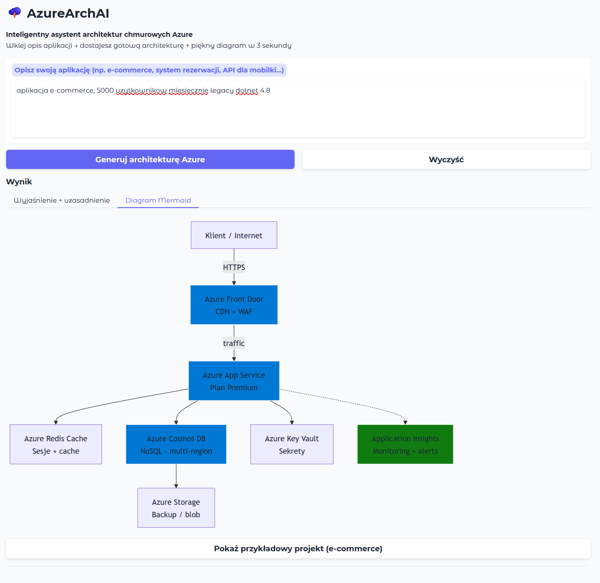

# AzureArchAI – Inteligentny Asystent Architektur Chmurowych Azure

**Asystent AI, który w 10 sekund projektuje architekturę Azure + rysuje diagram + tłumaczy dlaczego.**



## 1. Opis problemu i użytkownika
Juniorzy, studenci i małe firmy tracą godziny na research "jak zrobić to dobrze w Azure".  
AzureArchAI rozwiązuje to: podajesz opis aplikacji → dostajesz gotową architekturę, Mermaid diagram i uzasadnienie (koszty, skalowalność, best practices).

**Użytkownik docelowy:** studenci informatyki, junior developerzy, małe startupy.

## 2. Wymagania i scenariusze użycia

**Funkcjonalne:**
- Generowanie architektury Azure
- Rysowanie interaktywnego diagramu Mermaid
- Wyjaśnienie + szacunkowe koszty
- Historia poprzednich architektur

**Scenariusze:**
1. **"Zaproponuj architekturę dla e-commerce z 10k użytkowników dziennie"**  
   → Agent zwraca App Service + Cosmos DB + Redis + Front Door + Mermaid + uzasadnienie.
2. **"Pokaż diagram i policz koszty miesięczne"**  
   → Natychmiastowy diagram + kalkulacja.
3. **"Co byś zmienił na wersję enterprise?"** → Agent modyfikuje poprzednią architekturę.

## 3. Architektura i technologie


**Technologie:**
- **Python 3.12** + Gradio (UI)
- **GPT-4o-mini** (Azure OpenAI lub OpenAI)
- **Mermaid** (diagramy)
- **SQLAlchemy + SQLite** (historia)
- **asyncio** (asynchroniczność)

## 4. Zaawansowane techniki programowania

- **Wzorce projektowe:** Singleton (Database), Builder (prompt construction)
- **Programowanie funkcyjne:** map/filter przy przetwarzaniu komponentów Azure
- **Wielowątkowość/asynchroniczność:** async/await w wywołaniach LLM i Gradio
- **Integracja międzyjęzykowa/zewnętrzna:** SQLite przez SQLAlchemy (zewnętrzny system bazodanowy)

## 5. Instrukcja uruchomienia

```bash
# 1. Klonuj
git clone https://github.com/twoje/azurearchai.git && cd azurearchai

# 2. docker
 docker compose up -d ollama
 docker compose exec ollama ollama pull phi4-mini
 docker compose up -d --build
